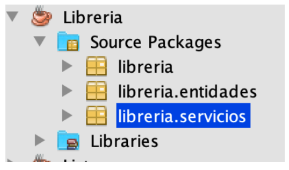

# Ejercicio1_JPA

***Sistema de Guardado de una Librería***
El objetivo de este ejercicio es el desarrollo de un sistema de guardado de libros en JAVA 
utilizando una base de datos MySQL y JPA como framework de persistencia. 
Creación de la Base de Datos MySQL: 
Lo primero que se debe hacer es crear la base de datos sobre el que operará el sistema de
reservas de libros. Para ello, se debe abrir el IDE de base de datos que se está utilizando
(Workbench) y ejecutar la siguiente sentencia: 
CREATE DATABASE libreria; 
De esta manera se habrá creado una base de datos vacía llamada librería.
Paquetes del Proyecto Java: 
Los paquetes que se utilizarán para este proyecto son los siguientes: 
• entidades: en este paquete se almacenarán aquellas clases que se quiere persistir en la
base de datos. 
• servicios: en este paquete se almacenarán aquellas clases que llevarán adelante la lógica
del negocio. En general se crea un servicio para administrar las operaciones CRUD
(Create, Remove, Update, Delete) cada una de las entidades y las consultas de cada
entidad. 
Nota: En este proyecto vamos a eliminar entidades, pero no es considerado una buena 
práctica. Por esto, además de eliminar nuestras entidades, vamos a practicar que nuestras
entidades estén dadas de alta o de baja. Por lo que las entidades tendrán un atributo “activo”
de tipo booleano, que estará en true al momento de crearlas y en false cuando las demos de
baja, para evitar eliminarlas de la base de datos. 

a) Entidades 
Crearemos el siguiente modelo de entidades: 
Entidad Libro 
La entidad libro modela los libros que están disponibles en la biblioteca para ser prestados. En
esta entidad, el atributo “ejemplares” contiene la cantidad total de ejemplares de ese libro,
mientras que el atributo “ejemplaresPrestados” contiene cuántos de esos ejemplares se
encuentran prestados en este momento y el atributo “ejemplaresRestantes” contiene cuántos
de esos ejemplares quedan para prestar. 
Entidad Autor 
La entidad autor modela los autores de libros. 
Entidad Editorial 
La entidad editorial modela las editoriales que publican libros. 
Base de Datos 
Para este proyecto nos vamos a conectar a la base de datos Librería, que creamos
previamente. 
Generación de Tablas 
La estrategia de generación de tablas define lo que hará JPA en cada ejecución, si debe crear
las tablas faltantes, si debe eliminar todas las tablas y volver a crearlas o no hacer nada.
Recomendamos en este proyecto utilizar la opción: “Create”
Librería de Persistencia 
Se debe seleccionar para este proyecto la librería “EclipseLink”. 
c) Servicios 
AutorServicio 
Esta clase tiene la responsabilidad de llevar adelante las funcionalidades necesarias para
administrar autores (consulta, creación, modificación y eliminación). 
EditorialServicio 
Esta clase tiene la responsabilidad de llevar adelante las funcionalidades necesarias para
administrar editoriales (consulta, creación, modificación y eliminación) 
LibroServicio 
Esta clase tiene la responsabilidad de llevar adelante las funcionalidades necesarias para
administrar libros (consulta, creación, modificación y eliminación). 
d) Main 
Esta clase tiene la responsabilidad de llevar adelante las funcionalidades necesarias para
interactuar con el usuario. En esta clase se muestra el menú de opciones con las operaciones
disponibles que podrá realizar el usuario. 
e) Tareas a realizar 
Al alumno le toca desarrollar, las siguientes funcionalidades: 
1) Crear base de datos Librería 
2) Crear unidad de persistencia 
3) Crear entidades previamente mencionadas (excepto Préstamo) 
4) Generar las tablas con JPA 
5) Crear servicios previamente mencionados. 
6) Crear los métodos para persistir entidades en la base de datos librería 
7) Crear los métodos para dar de alta/bajo o editar dichas entidades. 
8) Búsqueda de un Autor por nombre. 
9) Búsqueda de un libro por ISBN. 
10) Búsqueda de un libro por Título. 
11) Búsqueda de un libro/s por nombre de Autor. 
12) Búsqueda de un libro/s por nombre de Editorial. 
13) Agregar las siguientes validaciones a todas las funcionalidades de la aplicación: 
• Validar campos obligatorios. 
• No ingresar datos duplicados. 
